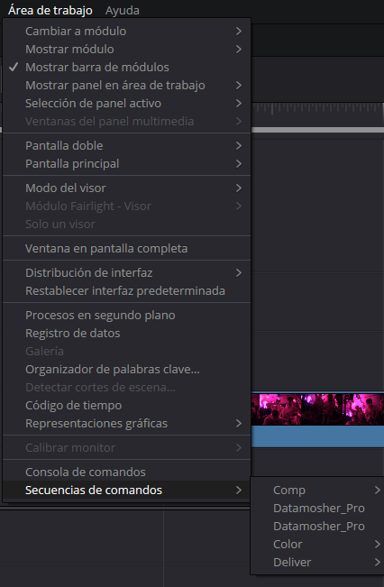
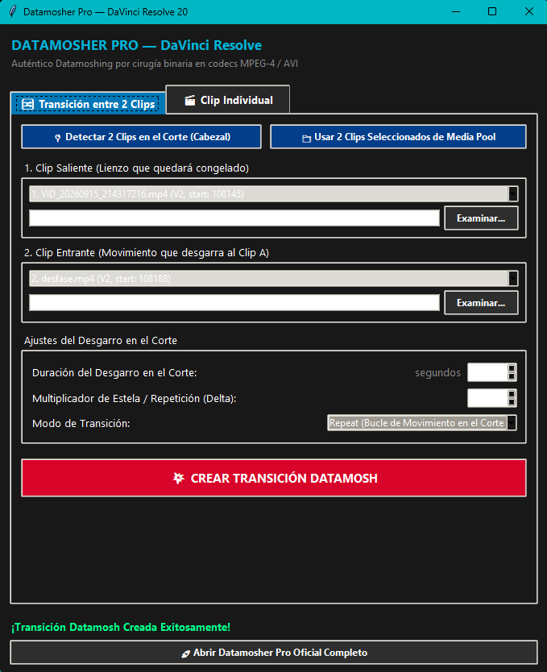

<div align="center">

# ⚡ Datamosh-Resolve ⚡
### Video Bitstream Datamoshing & Cut Transitions for DaVinci Resolve

[](https://www.microsoft.com/windows)
[](https://www.blackmagicdesign.com/products/davinciresolve)
[](https://www.python.org/)
[](https://ffmpeg.org/)
[](LICENSE)

<p align="center">
  <b>Automated I-frame removal, motion vector displacement transitions, and direct Media Pool import inside DaVinci Resolve.</b>
</p>

*Language: [English](README.md) | [Español](README.es.md)*

</div>

---

> [!IMPORTANT]
> ### ⚠️ Project Notice & Vibecoding Attribution
> This project has been largely **vibecoded** (developed with assistive AI tooling) and adapted from the open-source software **[Datamosher Pro](https://github.com/Akascape/Datamosher-Pro)** created by **[Akash Bora](https://github.com/Akascape)**.
>
> In the end, I needed this quickly to get a couple of things done and couldn't afford to waste time on manual setups, but if someone finds it interesting and useful, you are very welcome to use it. Any contribution is welcome. I might update it from time to time based on my own needs, as there are still some quirks or features I might want to expand later—who knows. **BUT I MAKE NO PROMISES.**
>
> Full recognition for the underlying video bitstream manipulation algorithms belongs to:
> - 👤 **[Akash Bora](https://github.com/Akascape)** (*Datamosher Pro*) — Core pipeline and automation architecture.
> - 👤 **[Kasper Ravel](https://github.com/itsKaspar)** (*Tomato Automosh*) — AVI stream delta-frame manipulation algorithms.
> - 👤 **[grampajoe](https://github.com/grampajoe)** (*pymosh*) — RIFF/AVI container parsing and MPEG-4 frame manipulation.
>
> **Licensing Compliance:**  
> Datamosher Pro, Tomato Automosh, and pymosh are distributed under the permissive **MIT License**, which allows incorporating, modifying, and redistributing code as long as original copyright and permission notices are preserved. See [LICENSE](LICENSE) for full details.

---

## 🔬 Technical Overview & Pipeline

Datamoshing produces visual motion artifacts by modifying compressed video streams prior to decoding, rather than applying 2D pixel filters. In inter-frame compression (MPEG-4 Part 2):
- **Intra-coded frames (I-frames):** Establish a full spatial reference image.
- **Predicted frames (P-frames):** Store only motion vectors and residual error data relative to prior frames.

When an I-frame at a cut point is stripped from the bitstream, the video decoder applies the incoming scene's motion vectors directly onto the unrefreshed pixel buffer of the outgoing scene, tearing macroblocks across the cut.

```mermaid
flowchart LR
    A["🎬 Timeline Cut\n(DaVinci Resolve)"] --> B["📍 Playhead Detection\n(Python Scripting API)"]
    B --> C["🎞️ Intermediate MPEG-4 AVI\n(Zero B-frames, Strict GOP)"]
    C --> D["✂️ Binary Bitstream Surgery\n(I-Frame Drop / Delta Loop)"]
    D --> E["⚙️ Transcode via libavcodec\n(Bake glitch into clean H.264)"]
    E --> F["📥 Auto-Import to Media Pool\n(Ready on Timeline)"]

    style A fill:#1e1e2e,stroke:#00b4d8,stroke-width:2px,color:#fff
    style B fill:#1e1e2e,stroke:#0077b6,stroke-width:2px,color:#fff
    style C fill:#1e1e2e,stroke:#7209b7,stroke-width:2px,color:#fff
    style D fill:#1e1e2e,stroke:#f72585,stroke-width:2px,color:#fff
    style E fill:#1e1e2e,stroke:#4cc9f0,stroke-width:2px,color:#fff
    style F fill:#1e1e2e,stroke:#06d6a0,stroke-width:2px,color:#fff
```



---

## ✨ Features

- 🔀 **Automated 2-Clip Cut Transitions:** Concatenates outgoing and incoming clips, surgically drops the keyframe at the exact cut point, and renders the baked transition.
- 📍 **Smart Timeline Playhead Detection:** Queries DaVinci Resolve's active timeline to automatically detect the two clips surrounding the playhead across any video track.
- 📋 **Timeline Video Clip Index:** Dropdown selector listing every video clip on the active timeline for custom pairings.
- 📁 **Media Pool Multi-Selection:** Select any two clips in the DaVinci Media Pool (`Ctrl + Click`) and load them with one click.
- 🎬 **Single Clip Datamoshing:** Apply motion trails, velocity bloom, and frame loops across user-defined time ranges on individual video clips.
- 📥 **Automated Media Pool Re-Import:** Automatically imports the finished MP4 file directly into the active project Media Pool.
- 🆓 **Full Compatibility:** 100% functional on **DaVinci Resolve Free** and **DaVinci Resolve Studio** (v20+ on Windows 64-bit).

---

## 📸 Interface & Workflow

<div align="center">

### 1. Launching from DaVinci Resolve Menu
Launch the tool from the top menu bar under **Workspace -> Scripts -> Datamosher_Pro**:



---

### 2. Transition Script Interface
Detect clips at the cut point or select from the Media Pool / dropdowns, adjust duration and delta, and trigger the transition:



---

### 3. Transition Result
Once rendering completes, the transition clip is automatically deposited into your active **Media Pool**. It contains the baked, genuine datamosh glitch where the incoming scene's motion vectors displace and tear the macroblocks of the frozen outgoing frame. Drag and drop it directly onto your timeline over the cut!

</div>

---

## 🎛️ Modes Reference

| Mode | Engine | Technical Operation |
|:---|:---|:---|
| 🟢 **Classic** | *Avidemux / pymosh* | Strips keyframe byte marker (`00 01 B0`) at the transition cut, forcing decoder motion interpolation onto the unrefreshed canvas. |
| 🟣 **Bloom** | *Tomato Automosh* | Replicates delta frames with frame-length scaling, producing explosive macroblock displacement. |
| 🔵 **Repeat** | *MPEG Packet Loop* | Duplicates consecutive P-frame packet sequences (`00 01 B6`) to create a looping motion trajectory. |
| ⚫ **Void** | *Tomato Automosh* | Detects scene boundaries and removes reference frames to dissolve incoming video into darkness. |

---

## 💻 System Requirements

- **Operating System:** Windows 10 or Windows 11 (64-bit only).
- **Host Application:** DaVinci Resolve 20.0 or later (Free or Studio edition).
- **Python:** Python 3.8 to 3.12 (must be registered in system `PATH`).
- **FFmpeg:** FFmpeg binary accessible in system `PATH`.
  - Install in PowerShell:
    ```powershell
    winget install Gyan.FFmpeg
    ```

---

## 📦 Installation (Windows)

### Method 1: 1-Click Automated Installer (Recommended)
1. Clone or download this repository:
   ```cmd
   git clone https://github.com/Cerrudoxx/datamosh-resolve.git
   ```
2. Double-click **`install.bat`**.
3. The script verifies dependencies and copies `Datamosher_Pro.py` and its libraries (`DatamoshLib/`, `pymosh/`) into:
   ```
   %APPDATA%\Blackmagic Design\DaVinci Resolve\Support\Fusion\Scripts\Edit\
   ```
4. Restart DaVinci Resolve if it was open.

### Method 2: Manual Installation
Copy `Datamosher_Pro.py` and the directories `DatamoshLib/` and `pymosh/` into:
```
%APPDATA%\Blackmagic Design\DaVinci Resolve\Support\Fusion\Scripts\Edit\
```

---

## 🚀 Step-by-Step Usage

### 2-Clip Transition Workflow
1. Open a project and timeline in DaVinci Resolve.
2. In the **Edit** page, place the playhead directly over the cut between two clips.
3. Open the script:
   👉 **Workspace → Scripts → Datamosher_Pro**
4. Click **`📍 Detect 2 Clips at Cut (Playhead)`**. The application will automatically identify Clip 1 (Outgoing) and Clip 2 (Incoming).
5. Configure parameters:
   - **Cut Glitch Duration:** Duration of the motion effect across the cut in seconds (e.g. `1.5s`).
   - **Motion Trail Multiplier (Delta):** Factor for motion vector duplication (e.g. `8`).
   - **Transition Algorithm:** `Classic`, `Bloom`, or `Repeat`.
6. Click **`💥 CREATE DATAMOSH TRANSITION`**.
7. The rendered transition file is saved in the source clip directory and automatically imported into your active **Media Pool**. Drag it directly onto the timeline!

---

## ❓ FAQ & Troubleshooting

<details>
<summary><b>Does this work on DaVinci Resolve Free?</b></summary>
Yes! The script communicates with DaVinci Resolve's Python API and performs bitstream surgery via Python and FFmpeg. It works on DaVinci Resolve 20 Free without watermarks or restrictions.
</details>

<details>
<summary><b>Why is FFmpeg required?</b></summary>
Authentic datamoshing cannot be achieved via 2D visual shader filters. It requires physical manipulation of MPEG-4 container packets (dropping <code>00 01 B0</code> byte sequences) and re-decoding via <code>libavcodec</code> to render genuine decoder decompression artifacts.
</details>

---

## 📄 License & Credits

This project is licensed under the **MIT License**. See [LICENSE](LICENSE) for details.
- **[Datamosher Pro](https://github.com/Akascape/Datamosher-Pro)** by Akash Bora (MIT License).
- **[Tomato Automosh](https://github.com/itsKaspar/tomato)** by Kasper Ravel (MIT License).
- **[pymosh](https://github.com/grampajoe/pymosh)** by grampajoe (MIT License).
- External tools (FFmpeg) are governed by their respective licenses (LGPL/GPL).
