<div align="center">

# ⚡ Datamosh-Resolve ⚡
### Video Bitstream Datamoshing & Cut Transitions for DaVinci Resolve

[](https://www.microsoft.com/windows)
[](https://www.blackmagicdesign.com/products/davinciresolve)
[](https://www.python.org/)
[](https://ffmpeg.org/)
[](LICENSE)

<p align="center">
  <b>Automated I-frame removal, motion vector displacement transitions, and direct Media Pool import inside DaVinci Resolve.</b>
</p>

*Language: [English](README.md) | [Español](README.es.md)*

</div>

---

> [!IMPORTANT]
> ### ⚠️ Project Notice & Vibecoding Attribution
> This project has been largely **vibecoded** (developed with assistive AI tooling) and adapted from the open-source software **[Datamosher Pro](https://github.com/Akascape/Datamosher-Pro)** created by **[Akash Bora](https://github.com/Akascape)**.
>
> In the end, I needed this quickly to get a couple of things done and couldn't afford to waste time on manual setups, but if someone finds it interesting and useful, you are very welcome to use it. Any contribution is welcome. I might update it from time to time based on my own needs, as there are still some quirks or features I might want to expand later—who knows. **BUT I MAKE NO PROMISES.**
>
> Full recognition for the underlying video bitstream manipulation algorithms belongs to:
> - 👤 **[Akash Bora](https://github.com/Akascape)** (*Datamosher Pro*) — Core pipeline and automation architecture.
> - 👤 **[Kasper Ravel](https://github.com/itsKaspar)** (*Tomato Automosh*) — AVI stream delta-frame manipulation algorithms.
> - 👤 **[grampajoe](https://github.com/grampajoe)** (*pymosh*) — RIFF/AVI container parsing and MPEG-4 frame manipulation.
>
> **Licensing Compliance:**  
> Datamosher Pro, Tomato Automosh, and pymosh are distributed under the permissive **MIT License**, which allows incorporating, modifying, and redistributing code as long as original copyright and permission notices are preserved. See [LICENSE](LICENSE) for full details.

---

## 🔬 Technical Overview & Pipeline

Datamoshing produces visual motion artifacts by modifying compressed video streams prior to decoding, rather than applying 2D pixel filters. In inter-frame compression (MPEG-4 Part 2):
- **Intra-coded frames (I-frames):** Establish a full spatial reference image.
- **Predicted frames (P-frames):** Store only motion vectors and residual error data relative to prior frames.

When an I-frame at a cut point is stripped from the bitstream, the video decoder applies the incoming scene's motion vectors directly onto the unrefreshed pixel buffer of the outgoing scene, tearing macroblocks across the cut.

```mermaid
flowchart LR
    A["🎬 Timeline Cut\n(DaVinci Resolve)"] --> B["📍 Playhead Detection\n(Python Scripting API)"]
    B --> C["🎞️ Intermediate MPEG-4 AVI\n(Zero B-frames, Strict GOP)"]
    C --> D["✂️ Binary Bitstream Surgery\n(I-Frame Drop / Delta Loop)"]
    D --> E["⚙️ Transcode via libavcodec\n(Bake glitch into clean H.264)"]
    E --> F["📥 Auto-Import to Media Pool\n(Ready on Timeline)"]

    style A fill:#1e1e2e,stroke:#00b4d8,stroke-width:2px,color:#fff
    style B fill:#1e1e2e,stroke:#0077b6,stroke-width:2px,color:#fff
    style C fill:#1e1e2e,stroke:#7209b7,stroke-width:2px,color:#fff
    style D fill:#1e1e2e,stroke:#f72585,stroke-width:2px,color:#fff
    style E fill:#1e1e2e,stroke:#4cc9f0,stroke-width:2px,color:#fff
    style F fill:#1e1e2e,stroke:#06d6a0,stroke-width:2px,color:#fff
```



---

## ✨ Features (v2.0)

- 🔀 **GOP-Aligned Bitstream Datamosh Engine:** Encodes outgoing and incoming clips separately into intermediate streams and joins them losslessly. Guarantees a targeted I-frame at the cut boundary and a precision recovery keyframe at the exact end of the glitch duration.
- ⏱️ **Independent Pre-Cut & Post-Cut Trims:** Fine-tune lead-in and tail durations independently with a live visual composition bar (`[Clip 1: Xs] ➔ ⚡ [GLITCH: Xs] ➔ [Clip 2: Xs]`).
- ⚡ **1-Click Style Presets:** Instant configuration with *Fluid Melt*, *Kinetic Stutter*, *Vector Bloom*, *Macro Glide*, and *Fast Whip*.
- 🎯 **Automated Timeline Placement:** Automatically creates or uses an upper video track (V2/V3) and drops the rendered transition centered over the cut point on the timeline.
- 🎛️ **7 Datamosher Pro Glitch Algorithms:** Full suite of bitstream manipulation modes with real-time in-UI descriptive guidance and usage tips.
- 🖼️ **Cut-Frame Thumbnail Previews:** Background extraction of the exact outgoing cut frame and incoming start frame for visual confirmation.
- 🎵 **Audio Crossfade Integration:** Optional smooth audio crossfading across the transition boundary.
- 📍 **Smart Timeline Playhead Detection:** Automatically inspects the active timeline at the playhead position, extracting trims, left offsets, and durations.
- 📋 **Timeline Video Clip Index & Media Pool Detection:** Full dropdown selector for timeline clips or instant loading from selected Media Pool clips.
- 🎬 **Single Clip Datamoshing:** Process individual clips across specific second ranges with all 7 engines.
- 🆓 **Full Compatibility:** 100% functional on **DaVinci Resolve Free** and **DaVinci Resolve Studio** (Windows 64-bit).

---

## 🎛️ Modes Reference

| Mode | Engine | Visual Behavior & Use Case |
|:---|:---|:---|
| 🟢 **Classic Motion Melt** | *Avidemux / Datamosher Pro* | **The iconic music-video datamosh.** Clip 2's movement drags and melts Clip 1's pixels at full natural speed without stuttering. Recovers sharply when the glitch ends. |
| ⚡ **Kinetic Stutter** | *Repeat / P-Frame Multiplier* | Repeats a short burst of initial motion vectors at the cut point for an energetic pulse. Ideal for beat drops and trap/hip-hop music videos. |
| 🌸 **Tomato Bloom** | *Tomato Automosh* | Duplicates motion vectors while suppressing intra data, causing pixels to burst outward in chromatic flares. |
| 🌊 **Macroblock Glide** | *Pymodes / Macroblock Smear* | Continuously smears compression macroblocks along directional motion vectors for smooth, painterly streaks. |
| 👻 **Echo Drift** | *Pymodes / Stream Echo* | Loops and drifts motion vectors across frames, producing an eerie trailing ghost effect. |
| 📡 **Tomato Pulse** | *Tomato Automosh* | Emits periodic, rhythmic waves of digital compression artifacts across the frame. |
| 🕳️ **Tomato Void** | *Tomato Automosh* | Pure bitstream automosh that strips keyframes by frame byte size for raw, unpredictable cut collisions. |

---

## 💻 System Requirements

- **Operating System:** Windows 10 or Windows 11 (64-bit only).
- **Host Application:** DaVinci Resolve 20.0 or later (Free or Studio edition).
- **Python:** Python 3.8 to 3.12 (must be registered in system `PATH`).
- **FFmpeg:** FFmpeg binary accessible in system `PATH`.
  - Install in PowerShell:
    ```powershell
    winget install Gyan.FFmpeg
    ```

---

## 📦 Installation (Windows)

### Method 1: 1-Click Automated Installer (Recommended)
1. Clone or download this repository:
   ```cmd
   git clone https://github.com/Cerrudoxx/datamosh-resolve.git
   ```
2. Double-click **`install.bat`**.
3. The installer verifies dependencies, places `Datamosher_Pro.py` into Fusion Scripts, and deploys the libraries (`DatamoshLib/`, `pymosh/`) into Fusion Modules (keeping your Workspace Scripts menu clean).
4. Restart DaVinci Resolve if it was open.

### Method 2: Manual Installation
1. Copy `Datamosher_Pro.py` into:
   ```
   %APPDATA%\Blackmagic Design\DaVinci Resolve\Support\Fusion\Scripts\Edit\
   ```
2. Copy the directories `DatamoshLib/` and `pymosh/` into:
   ```
   %APPDATA%\Blackmagic Design\DaVinci Resolve\Support\Fusion\Modules\
   ```
   *(Placing libraries in `Modules` ensures they load automatically while preventing DaVinci Resolve from cluttering your Scripts menu).*

---

## 🚀 Step-by-Step Usage

### 2-Clip Transition Workflow
1. Open a project and timeline in DaVinci Resolve.
2. In the **Edit** page, place the playhead directly over the cut between two clips.
3. Open the script:
   👉 **Workspace → Scripts → Datamosher_Pro**
4. Click **`📍 Detect 2 Clips at Cut (Playhead)`**. The application will automatically identify Clip 1 (Outgoing) and Clip 2 (Incoming).
5. Configure parameters:
   - **Cut Glitch Duration:** Duration of the motion effect across the cut in seconds (e.g. `1.5s`).
   - **Motion Trail Multiplier (Delta):** Factor for motion vector duplication (e.g. `8`).
   - **Transition Algorithm:** `Classic`, `Bloom`, or `Repeat`.
6. Click **`💥 CREATE DATAMOSH TRANSITION`**.
7. The rendered transition file is saved in the source clip directory and automatically imported into your active **Media Pool**. Drag it directly onto the timeline!

---

## ❓ FAQ & Troubleshooting

<details>
<summary><b>Does this work on DaVinci Resolve Free?</b></summary>
Yes! The script communicates with DaVinci Resolve's Python API and performs bitstream surgery via Python and FFmpeg. It works on DaVinci Resolve 20 Free without watermarks or restrictions.
</details>

<details>
<summary><b>Why is FFmpeg required?</b></summary>
Authentic datamoshing cannot be achieved via 2D visual shader filters. It requires physical manipulation of MPEG-4 container packets (dropping <code>00 01 B0</code> byte sequences) and re-decoding via <code>libavcodec</code> to render genuine decoder decompression artifacts.
</details>

---

## 📄 License & Credits

This project is licensed under the **MIT License**. See [LICENSE](LICENSE) for details.
- **[Datamosher Pro](https://github.com/Akascape/Datamosher-Pro)** by Akash Bora (MIT License).
- **[Tomato Automosh](https://github.com/itsKaspar/tomato)** by Kasper Ravel (MIT License).
- **[pymosh](https://github.com/grampajoe/pymosh)** by grampajoe (MIT License).
- External tools (FFmpeg) are governed by their respective licenses (LGPL/GPL).
